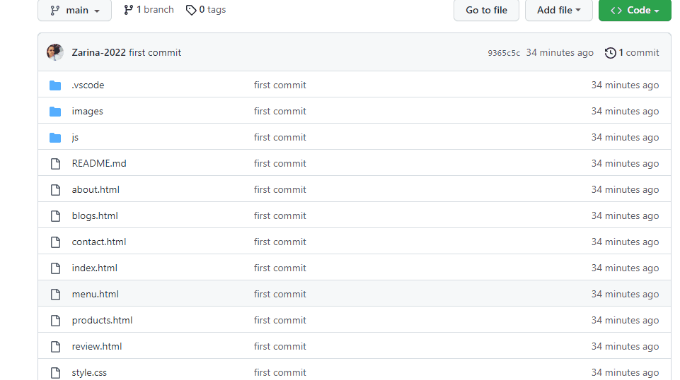

# Website-Restaurant

<h3> It is a restaurant website template built with HTML, CSS and JAVA SCRIPT. It is fully responsive.</h3>

<h2> <u>Also used the following resources: </u></h2>

<a> https://fontawesome.com/</a>

<a>https://www.google.nl/maps </a> 

<h3> Screen gif: </h3>

<h3> How to download? </h3>

